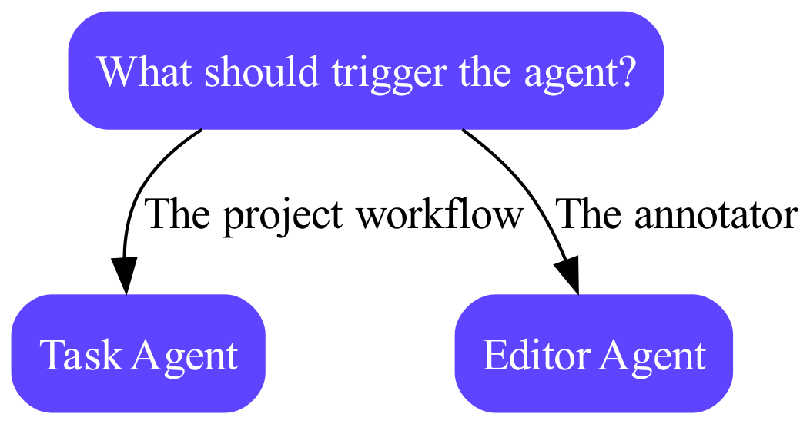

🚧 UNDER CONSTRUCTION 🚧

1. [Installation](#installation)
   1. [CLI](#cli)
   2. [Dependency](#dependency)
   3. [Settings](#settings)
2. [Editor agents](#editor-agents)
   1. [GCP Cloud run functions](#gcp-cloud-run-functions)
      1. [GCP Examples](#gcp-examples)
         1. [Add a bounding box](#add-a-bounding-box)
         2. [Call GPT-4o to verify classifications](#call-gpt-4o-to-verify-classifications)
         3. [Label verification](#label-verification)
      2. [GCP Cloud run function deployment](#gcp-cloud-run-function-deployment)
   1. [FastAPI](#fastapi)
      1. [FastAPI Examples](#fastapi-examples)
         1. [Add a bounding box](#add-a-bounding-box)
         2. [Run inference with an object detection model](#run-inference-with-an-object-detection-model)
         3. [Call GPT-4o to verify classifications](#call-gpt-4o-to-verify-classifications)
         4. [Label verification](#label-verification)
      2. [FastAPI Deployment](#fastapi-deployment)
3. [Task agents](#task-agents)

# Encord Agents Framework

This repository provides utility functions and examples for building both [editor agents][editor_agents] and [task agents][task_agents].

The framework allows you to do the following things

1. Initialize a template project GCP Cloud functions as an agent.
2. Easily load data via the Encord SDK for model inference or quality control.
3. Create FastAPI applications for agents with pre built dependencies for loading labels and data.
4. [coming soon] Start long running process to act as Agent nodes in Encord project workflows.

Here's how you decide which of the patterns to follow.



Some examples of what you could do with each type of agent:

**Editor Agent**:

- _Validate the current state of the annotations_ within a frame, video, or image group.
- Do _custom conversions_ between label types.
- _Trigger notifications_ internally related to the given task.

Think of these agents as agents that your annotators can trigger at will _while they are labeling_.

If you plan to build an editor agent, please go to the [Editor agents section](#editor-agents).

**Task Agents**:

- _Pre-labeling_ of your data, e.g., with your own model or of-the-shelf models.
- _Custom routing_ of data in the project workflow.
- _Dynamic prioritization_ of your tasks.
- _Custom "label assertions"_ that validate, e.g., number of labels or other constraings, before sending them for review.

Think of these agents as agents that will _automatically_ trigger as soon as a task reaches the associated agent state in the project workflow.

If you plan to build a label agent, please go to the [Task agents section](#task-agents).

# Installation

> We recommend that you use python 3.11. Few things will have to be adapted if you want to use a later version.

This repo can be installed as a slim command-line interface (CLI) to help setup and test projects and as a dependency for the implementation of an agent.

### CLI

For the CLI, we recommend installing it via [`pipx`][pipx].

```shell
pipx install https://github.com/encord-team/encord-agents.git

# This works for Encordians already hopefully 🤞
pipx install git+ssh://git@github.com/encord-team/encord_agents.git#egg=encord_agents
```

Now, you can, e.g., do `encord-agents gcp init <your_project_name>` to initialize a new python project with the
required dependencies for a GCP cloud run function project.
See [GCP functions](#gcp-cloud-run-functions) below for more details.

### Dependency

There are multiple different extras that you can install - depending on how you want to setup your project.
If you are building a new FastAPI application for editor agents, you should install the project with

```
python -m pip install "encord-agents[fastapi]"
```

if you plan to use the project with GCPs `functions_framework`, then do

```
python -m pip install "encord-agents[gcp-functions]"
```

Finally, if you want to manage all the dependencies on your own, the only necessary dependencies for the `core` module
can be installed with

```
python -m pip install "encord-agents[core]"
```

### Settings

The tool will in many cases have to authenticate with Encord.
For that, environment variables are used.  
Specifically, you need to [setup an ssh key]() for a service account and use the private key to authenticate with.
For any project where you want to use your agent, you will have to assign that service account admin rights.

> 💡 Note: for testing, you can may want to use your own personal ssh-key.

To set the environment variables, you should do one of the following two:

1. Set the `ENCORD_SSH_KEY` env variable with the raw key content.
2. Set the `ENCORD_SSH_KEY_FILE` env variable with the absolute path to the key.

If none of them are set, the code will cast a pydantic validation error the first time it needs the ssh key.

> ℹ️ Effectively, [this part][docs-ssh-key-access] of the `encord` SDK is used.

# Editor agents

[[📚 full docs][editor_agents]] [[👆 to the top][to_top]]

For the examples in this section, you have two choices for setups.
You can host your agent via GCP cloud functions or via a self-hosted FastAPI server.
For light-weight application like a label checks, we recommend cloud functions, while agents that employ more heavy deep learning models are more suited for a FastAPI setup.

> 💡 **Do you prefer another type of hosting?**  
> While we show you two ways in which you can host an editor agent, the options are endless.
> You need to host a public url that accepts POST requests with data of the format (sent from the Encord label editor):
>
> ```
> {
>     "projectHash": "<project_hash>",  # uuid
>     "dataHash": "<data_hash>",        # uuid
>     "frame": 0                        # int
> }
> ```
>
> and responds with a 200 status.
> Please see the [full doct][editor_agents] for more details.
>
> There are multiple "nice" utilities in the `encord_agents.core` module which might be useful in other hosting senarios.
> There is, e.g., code for extracting the right frame based on the message from the editor. # TODO make link

## GCP Cloud run functions

### GCP Examples

#### Add a bounding box

This example shows how to add a bounding box to the given frame that an annotator is triggering the agent from.

First, let's setup a project.

```shell
git clone https://github.com/encord-team/encord-agents.git
encord-agents gcp init bounding_box_project --src-file encord-agents/examples/gcp/add_bounding_box.py
```

Follow the instructions in the terminal to create virtual enviroment and install dependencies.

In the `bounding_box_project` directory, you should have a `main.py` file looking like this:

```python
from encord.objects.coordinates import BoundingBoxCoordinates
from encord.objects.ontology_labels_impl import LabelRowV2

from encord_agents import FrameData
from encord_agents.gcp import editor_agent


@editor_agent()
def my_editor_agent(frame_data: FrameData, label_row: LabelRowV2) -> None:
    ins = label_row.ontology_structure.objects[0].create_instance()
    ins.set_for_frames(
        frames=frame_data.frame,
        coordinates=BoundingBoxCoordinates(
            top_left_x=0.2, top_left_y=0.2, width=0.6, height=0.6
        ),
    )
    label_row.add_object_instance(ins)
    label_row.save()
```

In the code, we:

1. We mark our function with the [`@editor_agent`][editor-agent] decorator. That will provide us with two arguments to the function.

   1. A [`FrameData`][frame-data-code] instance which tells which `project_hash`, `data_hash`, and `frame` the agent was triggered from.
   2. A [`LabelRowV2`][label_row_v2] instance already instantiated with the current label state.

2. Create an object instance (assuming that the first object in the ontology is a bounding box object) and call `set_for_frames` with bounding box coordinates and a given frame.
3. Add the new instance to the `label_row`.
4. Save the label row.

> 💡 Hint: For more information on how to use the SDK to manipulate labels, please see the [SDK documentation][docs-sdk-label] 📖

From within the directory, you can start the agent by running

```
encord-agents gcp run add_bunding_box
```

From another shell, run `encord-agents test local <target> <editor_url>` to trigger the agent.
`<target>` is the name of the function.
`<editor_url>` is the url you see in the browser when you are editing an image/frame of a video on the platform.

---

#### Call GPT-4o to verify classifications

[coming soon]

---

#### Label verification

[coming soon]

### GCP Cloud run function deployment

While we refer to the [google documentation][google-gcp-functions-docs] for deployment of cloud run functions, we do provide an example command via the CLI:

```shell
encord-agents gcp deploy <target_function>
```

This will print a template for the command to run against `gcloud` in order to push your function to the cloud.

> :bulb: Remember to configure secrets for the `ENCORD_SSH_KEY`/`ENCORD_SSH_KEY_FILE` variable.
> Documentation is [here 📖][google-gcp-secrets-docs].

## FastAPI

### FastAPI Examples

#### Add a bounding box

This example shows how to create a FastAPI project which adds a bounding box the a give frame based on a trigger from the label editor.

First, let's setup a project.

```shell
pyenv local 3.11 # (optional): we use pyenv to manage python versions
python -m venv venv
source venv/bin/activate
python -m pip install -e "git+ssh://git@github.com/encord-team/encord_agents.git#egg=encord-agents[fastapi]" # 'TODO FIX ME'
```

> 💡 Hint: If you want to manage dependencies like, e.g., `fastapi` and `uvicorn` on your own, you can install `encord[core]`.
> Please see the [dependencies](#dependency) section for more about details.

Now, let's setup a simple server.
In the directory, create a file called `main.py` with the following content:

```python
from encord.objects.coordinates import BoundingBoxCoordinates
from encord.objects.ontology_labels_impl import LabelRowV2
from encord_agents import FrameData
from encord_agents.fastapi.dependencies import dep_label_row
from fastapi import Depends, FastAPI
from fastapi.middleware.cors import CORSMiddleware
from typing_extensions import Annotated

app = FastAPI()
app.add_middleware(
    CORSMiddleware,
    allow_origins=["https://app.encord.com"],
)


@app.post("/add_bounding_box")
def tmp(
    frame_data: FrameData, label_row: Annotated[LabelRowV2, Depends(dep_label_row)]
):
    ins = label_row.ontology_structure.objects[0].create_instance()
    ins.set_for_frames(
        frames=frame_data.frame,
        coordinates=BoundingBoxCoordinates(
            top_left_x=0.2, top_left_y=0.2, width=0.6, height=0.6
        ),
    )
    label_row.add_object_instance(ins)
    label_row.save()
```

In the code, we:

1. Create a new `FastAPI` app which allows cross-origin communication fro "https://app.encord.com" to be able to recieve messages from the label editor.

1. Define a POST endpoint with two parameters.

   1. A [`FrameData`][frame-data-code] instance which tells which `project_hash`, `data_hash`, and `frame` the agent was triggered from.
   2. A [`LabelRowV2`][label_row_v2] instance already instantiated with the current label state.

1. Create an object instance (assuming that the first object in the ontology is a bounding box object) and call `set_for_frames` with bounding box coordinates and a given frame.
1. Add the new instance to the `label_row`.
1. Save the label row.

> 💡 Hint: For more information on how to use the SDK to manipulate labels, please see the [SDK documentation][docs-sdk-label] 📖

From within the directory, you can start the fastapi server by running

```
ENCORD_SSH_KEY_FILE=/path/to/your/private/key fastapi dev main.py
```

From another shell, run `encord-agents test local --port 8000 <editor_url>` to trigger the agent.
`<editor_url>` is the url you see in the browser when you are editing an image/frame of a video on the platform.
Now, try to refresh the browser to see the bounding box appear in the label editor.

---

#### Run inference with an object detection model

This example will show you how to run inference with a (pretrained) model from hugging face.

We'll assume the following setup:

> You have a project with an ontology of bounding box objects for which the names overlap with the names of the coco classes.

An example could be this ontology structure:

```json
{
  "objects": [
    {
      "id": "1",
      "name": "Person",
      "color": "#D33115",
      "shape": "bounding_box",
      "featureNodeHash": "2f9d0818"
    },
    {
      "id": "2",
      "name": "Bus",
      "color": "#E27300",
      "shape": "bounding_box",
      "featureNodeHash": "c5a44abb"
    },
    {
      "id": "3",
      "name": "Dog",
      "color": "#16406C",
      "shape": "bounding_box",
      "featureNodeHash": "65282ca1"
    }
  ],
  "classifications": []
}
```

**Setup:**
From an empty project directory, create a new virtual python environment and install a couple of dependencies:

```
pyenv local 3.12
python -m venv venv
source venv/bin/activate
python -m pip install "encord-agents[fastapi]" pytorch torchvision transformers
```

Then create a `main.py` file with this content:

```python
import numpy as np
import torch
import torch.nn as nn
from encord.objects.common import Shape
from encord.objects.coordinates import BoundingBoxCoordinates
from encord.objects.ontology_labels_impl import LabelRowV2
from encord_agents import FrameData
from encord_agents.fastapi.dependencies import dep_asset, dep_label_row
from fastapi import Depends, FastAPI
from fastapi.middleware.cors import CORSMiddleware
from PIL import Image
from transformers import DetrForObjectDetection, DetrImageProcessor
from typing_extensions import Annotated

THRESHOLD = 0.8

# Load the model from HF
device = torch.device(
    next(
        filter(
            None,
            (
                "mps" if torch.backends.mps.is_available() else None,
                "cuda" if torch.cuda.is_available() else None,
                "cpu",
            ),
        )
    )
)
print(device)

processor = DetrImageProcessor.from_pretrained(
    "facebook/detr-resnet-50", revision="no_timm"
)
model = DetrForObjectDetection.from_pretrained(
    "facebook/detr-resnet-50", revision="no_timm"
).to(device)

# Create a fast api server
app = FastAPI()
app.add_middleware(
    CORSMiddleware,
    allow_origins=["https://app.encord.com"],
)


def _center_to_xywh(bboxes_center: torch.Tensor) -> torch.Tensor:
    """
    Translate bounding boxes
    relative [cx, cy, w, h] => relative [x, y, w, h]
    """
    center_x, center_y, width, height = bboxes_center.unbind(-1)
    bbox_corners = torch.stack(
        [(center_x - 0.5 * width), (center_y - 0.5 * height), width, height],
        dim=-1,
    )
    return bbox_corners


# Create the endpoint
@app.post("/predict")
def predict_bounding_boxes(
    frame_data: FrameData,
    label_row: Annotated[LabelRowV2, Depends(dep_label_row)],
    asset: Annotated[np.ndarray, Depends(dep_asset)],
):
    # Map between HF model label names to encord objects
    ont_lookup = {
        o.name.lower(): o
        for o in label_row.ontology_structure.objects
        if o.shape == Shape.BOUNDING_BOX
    }

    # Run inference
    with torch.inference_mode():
        image = Image.fromarray(asset).convert("RGB")
        inputs = processor(images=image, return_tensors="pt").to(device)
        outputs = model(**inputs)

    # Transform results
    bboxes, logits = outputs.pred_boxes[0], outputs.logits[0]
    bboxes = _center_to_xywh(bboxes).cpu()

    prob = nn.functional.softmax(logits, -1).cpu()
    scores, labels = prob[..., :-1].max(-1)

    # Assign labels
    for score, label, box in zip(scores, labels, bboxes):
        if score < THRESHOLD:
            continue

        label_name = model.config.id2label[label.item()]

        ontology_object = ont_lookup.get(label_name.lower())
        if not ontology_object:
            continue

        ins = ontology_object.create_instance()
        x, y, w, h = box.tolist()
        ins.set_for_frames(
            frames=frame_data.frame,
            coordinates=BoundingBoxCoordinates(
                top_left_x=x, top_left_y=y, width=w, height=h
            ),
        )
        label_row.add_object_instance(ins)

    label_row.save()
```

To run the server in development mode:

```
ENCORD_SSH_KEY_FILE=/path/to/your/private_key fastapi dev main.py
```

Test the agent by:

1. Going to the label editor of that project you want to use the agent for
2. Copy the browser url
3. From a fresh terminal run the following command:

```shell
encord-agents test local --port 8000 predict <your_editor_url>
```

4. Refresh the browser

Now you should see some predictions pre-labeled.
Please refer to the [deployment section](#fastapi-deployment) once you're ready to deploy your agent.

---

#### Call GPT-4o to verify classifications

[coming soon]

---

#### Label verification

[coming soon]

### FastAPI Deployment

While we refer to the [fastapi documentation][fastapi-deploy-docs] for best practices on deployment of fastapi apps, we do provide a basic docker file setup here:

```shell
TODO I suppose that we'd want to do this right?
```

To try the docker image locally, you can run

```shell
docker build -t my_custom_agent:v1
docker run \
    -p 8000:8000 \
    -v /whatever:. \
    -e ENCORD_SSH_KEY=`cat $ENCORD_SSH_KEY_FILE` \
    my_custom_agent:v1
```

Now you should be able to test it with

```shell
encord_agents test local --port 8000 <your_endpoint> <editor_url>
```

# Task agents

[[📚 full docs][task_agents]] [[👆 to the top][to_top]]

[editor_agents]: https://docs.encord.com/platform-documentation/Annotate/automated-labeling/annotate-editor-agents
[task_agents]: https://docs.encord.com/platform-documentation/Annotate/automated-labeling/annotate-task-agents
[to_top]: #encord-agents-framework
[poetry]: https://python-poetry.org/
[label_row_v2]: https://docs.encord.com/sdk-documentation/sdk-references/LabelRowV2
[pipx]: https://github.com/pypa/pipx
[frame-data-code]: https://github.com/encord-team/encord-agents/blob/main/encord_agents/core/data_model.py#L6
[editor-agent]: https://github.com/encord-team/encord-agents/blob/main/encord_agents/gcp/wrappers.py#L65
[docs-ssh-key-access]: https://docs.encord.com/sdk-documentation/sdk-references/EncordUserClient#create-with-ssh-private-key
[docs-sdk-label]: https://docs.encord.com/sdk-documentation/sdk-labels/sdk-working-with-labels
[google-gcp-functions-docs]: https://cloud.google.com/functions/docs/create-deploy-gcloud
[google-gcp-secrets-docs]: https://cloud.google.com/functions/docs/configuring/secrets
[fastapi-deploy-docs]: https://fastapi.tiangolo.com/deployment/
