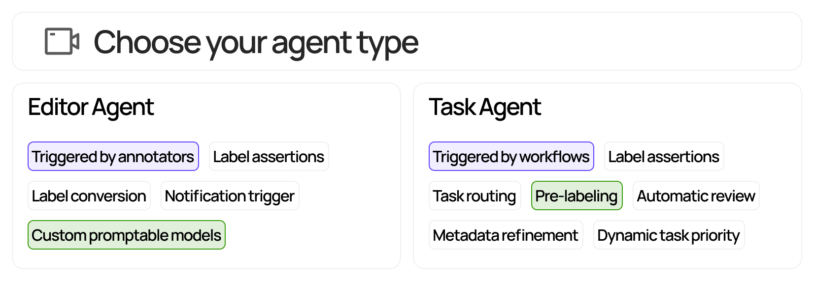

# Encord Agents

Easily build agents for the Encord echo system.
With just few lines of code, you can take automation to the next level.

Here's how to build a [Task Agent](task_agents/index.md) that prioritizes annotation tasks based on custom metadata.

```python title="example_task_agent.py"
from typing import Any

from encord.objects import LabelRowV2
from encord_agents.tasks import TaskRunner

runner = TaskRunner(project_hash="<your_project_hash>")

@runner.stage(name="Agent 1", use_client_metadata=True)
def by_city(lr: LabelRowV2, client_metadata: dict | None) -> str | None:
    location = (client_metadata or {}).get("location")

    priority = 0.
    if location == "New York":
        priority = 1.
    else if location == "San Francisco":
        priority = 0.5

    label_row.set_priority(priority=priority)

if __name__ == "__main__":
    runner.run(update_every=3600, max_workers=1, num_retries=3)
```

> 💡 For the full end-to-end example, please see [here](TODO).

This repository provides utility functions and examples for building both [editor agents][editor_agents] and [task agents][task_agents].

**Key features:**

1. ⚡**Easy**: Multiple template agents to be adapted and hosted via GCP, own infra, or cloud.
2. ⏩ **Convenient**: the library conveniently loads data via the [Encord SDK][encord_sdk] upon request.
3. 👨‍💻 **Focus**: With essential resources readily available, you can focus on what matters. Create [FastAPI][fastapi] applications for hosting agents with pre-existing dependencies for loading labels and data.
4. 🤏 **Slim**: the library is slim at it's `core` and should not conflict with the dependencies of most projects.

**Choose what type of agent to use:**



If you plan to build an editor agent, please go to the [Editor agents section](#editor-agents).

If you plan to build a label agent, please go to the [Task agents section](#task-agents).

[editor_agents]: https://docs.encord.com/platform-documentation/Annotate/automated-labeling/annotate-editor-agents
[task_agents]: https://docs.encord.com/platform-documentation/Annotate/automated-labeling/annotate-task-agents
[encord_sdk]: https://pypi.org/project/encord/
[fastapi]: https://fastapi.tiangolo.com/
[poetry]: https://python-poetry.org/
[label_row_v2]: https://docs.encord.com/sdk-documentation/sdk-references/LabelRowV2
[pipx]: https://github.com/pypa/pipx
[frame-data-code]: https://github.com/encord-team/encord-agents/blob/main/encord_agents/core/data_model.py#L6
[editor-agent]: https://github.com/encord-team/encord-agents/blob/main/encord_agents/gcp/wrappers.py#L65
[docs-ssh-key-access]: https://docs.encord.com/sdk-documentation/sdk-references/EncordUserClient#create-with-ssh-private-key
[docs-sdk-label]: https://docs.encord.com/sdk-documentation/sdk-labels/sdk-working-with-labels
[google-gcp-functions-docs]: https://cloud.google.com/functions/docs/create-deploy-gcloud
[google-gcp-secrets-docs]: https://cloud.google.com/functions/docs/configuring/secrets
[fastapi-deploy-docs]: https://fastapi.tiangolo.com/deployment/
