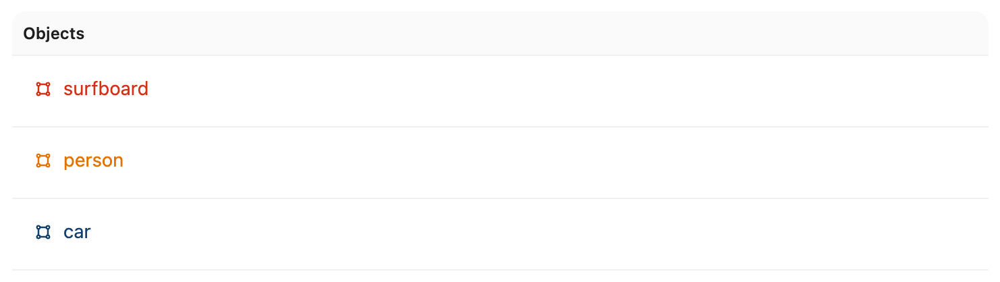
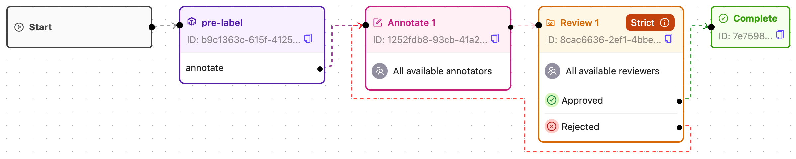

## Pre-label video with _fake_ predictions

### Step 1: Define a _fake_ model for predictions

Suppose you have a _fake_ model like this one, which predicts labels, bounding boxes, and confidences.

<!--codeinclude-->

[Fake model predictions](../../code_examples/tasks/prelabel_videos.py) lines:29-52

<!--/codeinclude-->

### Step 2: Set up your Ontology

Create an Ontology that matches the expected output of your pre-labeling agent. For example:

<figure style="text-align: center">
  
  Project ontology.
</figure>

### Step 3: Create a Workflow with a pre-labeling agent node

Create a Workflow template that includes a pre-labeling agent node before the annotation stage to automatically pre-label tasks with model predictions.

<figure style="text-align: center">
  
  Project workflow.
</figure>

### Step 4: Create your pre-labeling agent

Create a pre-labeling agent using the following code as a template:

<!--codeinclude-->

[prelabel_video.py](../../code_examples/tasks/prelabel_videos.py) lines:10-77

<!--/codeinclude-->

This code uses the [`dep_video_iterator` dependency](../../reference/task_agents.md#encord_agents.tasks.dependencies.dep_video_iterator) to automatically load an iterator of frames as RGB numpy arrays from the video.

### Step 5: Run the agent

Follow these steps to execute the agent:

1. Ensure that you have exported your private key, as described in the [authentication section](../../authentication.md){target=\_blank}, and installed the `encord_agents` package, as explained in the [installation guide](../../installation.md){target=\_blank}.
2. Confirm that your Project includes a stage named **"pre-label"** with a pathway named **"annotate"**, and that its ontology resembles the example above.
3. Replace `<project_hash>` in the script with your own Project hash.
4. Execute the script using the following command:

   ```bash
   python prelabel_video.py
   ```

### Step 6: Verify pre-labeled annotations

Once the agent completes, start annotating. You should see frames pre-populated with bounding boxes generated by the _fake_ model predictions.

## Further examples available soon

T following Agent examples will become available soon:

- Pre-labeling with YoloWorld
- Transcribing with Whisper
- Routing with Gemini
- Prioritizing with GPT-4o mini
- Evaluating Training projects
- HF Image segmentation API
- HF LLM API to classify frames
